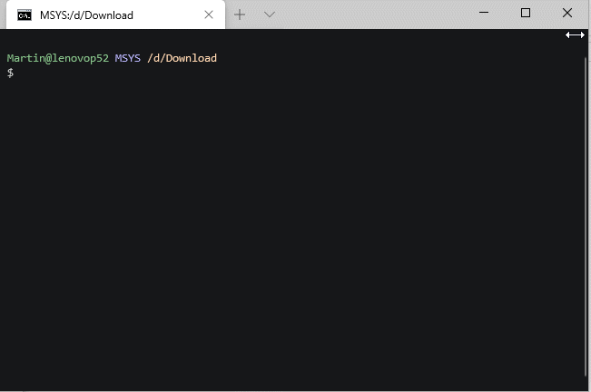
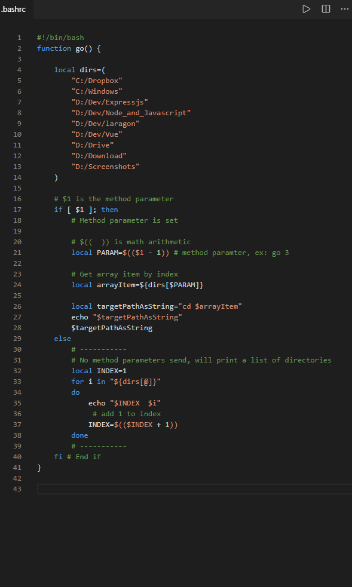

# .bashrc bash-quickly switch to favorite directory
bash quickly switch to favorite directory with numbers listing

There is two commands:


```go```
will simply list your directorys


```go [number]```
will go the that directory


# example:



# Customize you favorite paths:



# notes
rename "bashrc.txt" to ".bashrc" and place it in your home directory

# Notes for windows:
in your .bash_profile, add the lines
```
# Read .bashrc
source ~/.bashrc
```
